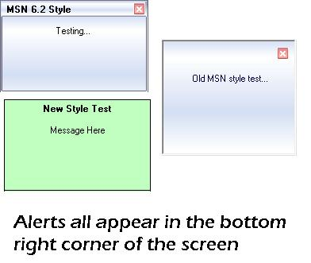



## Popup Alerts

### Description

With this you can produce three types of alert boxes in the bottom right corner of the screen. You can make new MSN style, Old MSN style and a simple flat one. The MSN boxes are pretty good reproductions of the real thing. I should probably remake with API instead of timers etc. but this will do for now.

Basically a little alert slides up, waits for five seconds and slides down again.

Enjoy (and vote)!
 
### More Info
 

             |
---                |---
**Submitted On**   |2004-05-07 18:27:34
**By**             |[Tom Hendriks](https://github.com/Planet-Source-Code/PSCIndex/blob/master/ByAuthor/tom-hendriks.md)
**Level**          |Intermediate
**User Rating**    |4.7 (14 globes from 3 users)
**Compatibility**  |VB 3\.0, VB 4\.0 \(16\-bit\), VB 4\.0 \(32\-bit\), VB 5\.0, VB 6\.0
**Category**       |[Custom Controls/ Forms/  Menus](https://github.com/Planet-Source-Code/PSCIndex/blob/master/ByCategory/custom-controls-forms-menus__1-4.md)
**World**          |[Visual Basic](https://github.com/Planet-Source-Code/PSCIndex/blob/master/ByWorld/visual-basic.md)
**Archive File**   |[Popup\_Aler174326582004\.zip](https://github.com/Planet-Source-Code/tom-hendriks-popup-alerts__1-53659/archive/master.zip)

